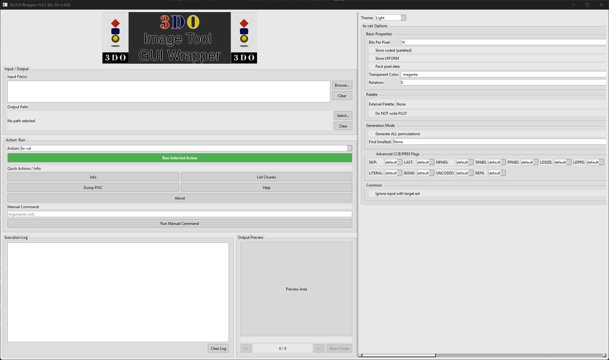

# 3DO Image Tool GUI Wrapper (v1.6.1 for 3it v1.8.0)


 <!-- Add a screenshot of your GUI here -->

A user-friendly graphical interface (GUI) built with Python and PySide6 for Trapexit's powerful command-line tool, **[3it](https://github.com/trapexit/3it)**, designed for 3DO image conversions.

This wrapper aims to make `3it`'s features accessible without needing to memorize command-line arguments, providing a visual way to convert images to and from various 3DO and standard formats.

## Features

*   Supports most `3it` conversion subcommands (`to-cel`, `to-banner`, `to-imag`, `to-png`, etc.).
*   Provides access to common conversion options via checkboxes, dropdowns, and text fields.
*   Handles single or multiple input files.
*   Visual file selection for inputs and outputs.
*   Intelligent output path handling (specify file/dir, or default to input directory).
*   Includes an output log to view `3it`'s console output directly.
*   Basic image previewer for common output formats.
*   Manual command input for advanced users.
*   Light/Dark theme switching.
*   Built-in help window summarizing `3it` commands.

## ⚠️ Important Antivirus / Windows Security Notice ⚠️

The pre-built executable versions (`ThreeItGUI.zip` and `ThreeItGUIPortable.exe`) are created using **PyInstaller**. Unfortunately, PyInstaller executables are often **incorrectly flagged** by some antivirus software (including Windows Security/Defender) as malicious (e.g., `Trojan:Win32/Wacatac.B!ml`).

**This is a known false positive.** The executable does *not* contain any malware. PyInstaller bundles the Python interpreter and necessary libraries, and this process can sometimes trigger heuristic detection in antivirus scanners.

**What to do:**

1.  **Verify:** You can upload the downloaded file to online scanners like [VirusTotal](https://www.virustotal.com/) to see that most engines recognize it as safe.
2.  **Exclude:** You may need to temporarily disable your real-time protection or **add an exclusion** for the downloaded file or the extracted folder in your antivirus settings to allow it to run.
3.  **Use Source:** If you are uncomfortable with the executable or cannot configure exclusions, please use the "Running from Source" method described below, which avoids the PyInstaller wrapper entirely.

We apologize for this inconvenience, but it is a common issue with PyInstaller-packaged applications.

## Installation and Usage

There are two main ways to use this GUI:

**1. Pre-built Executable (Recommended for most users)**

Download the latest release from the [**Releases Page**](https://github.com/Hackinside/3DO-Image-Tool-GUI-Wrapper/releases). Choose one:

*   **`ThreeItGUI.zip`**:
    1.  Download the `.zip` file.
    2.  **Antivirus Step:** Before extracting, you might need to configure your antivirus to exclude this file or the destination folder (see Warning above).
    3.  Extract the contents to a folder on your computer.
    4.  Place the required `3it.exe` (v1.8.0 or compatible) inside the extracted folder, either directly alongside `ThreeItGUI.exe` or inside a `bin` subfolder. Get `3it.exe` from the [official 3it releases](https://github.com/trapexit/3it/releases).
    5.  Run `ThreeItGUI.exe` from the extracted folder.

*   **`ThreeItGUIPortable.exe`**:
    1.  Download the single `.exe` file.
    2.  **Antivirus Step:** You will likely need to configure your antivirus to exclude this specific file (see Warning above).
    3.  Place the required `3it.exe` (v1.8.0 or compatible) either in the *same directory* as `ThreeItGUIPortable.exe` or inside a `bin` subfolder next to it. Get `3it.exe` from the [official 3it releases](https://github.com/trapexit/3it/releases).
    4.  Run `ThreeItGUIPortable.exe`. (Note: Startup might be slightly slower than the `.zip` version).

**2. Running from Source (Requires Python)**

This method avoids the PyInstaller wrapper and the associated antivirus false positives.

1.  **Download:** Download the `3itGuiPython.zip` file from the [**Releases Page**](https://github.com/Hackinside/3DO-Image-Tool-GUI-Wrapper/releases).
2.  **Extract:** Extract the contents to a location on your computer (e.g., `C:\Tools\3itGUI`).
3.  **Get `3it.exe`:** Place the required `3it.exe` (v1.8.0 or compatible) inside the extracted folder, either directly in the root (next to `main_gui_v1.6.1.py`) or inside a `bin` subfolder. Get `3it.exe` from the [official 3it releases](https://github.com/trapexit/3it/releases).
4.  **Setup Environment:**
    *   Open a command prompt or terminal.
    *   Navigate (`cd`) into the extracted folder (e.g., `cd C:\Tools\3itGUI`).
    *   **Activate the virtual environment:**
        *   On Windows: `.\venv\Scripts\activate`
        *   On macOS/Linux: `source ./venv/bin/activate`
    *   You should see `(venv)` appear at the beginning of your prompt.
    *   **Install Dependency:** While the venv is active, run: `pip install PySide6`
5.  **Run the GUI:** While the venv is active, run the Python script:
    ```bash
    python main_gui_v1.6.1.py
    ```

*(Note: The included `venv` is pre-configured for convenience, but you could also create your own fresh Python 3.8+ virtual environment and install `PySide6`)*

## Configuration

*   **`3it.exe` Location:** The GUI expects `3it.exe` (v1.8.0 recommended) to be located in **one** of these places relative to the GUI executable or script:
    1.  Inside a subfolder named `bin` (e.g., `INSTALL_FOLDER/bin/3it.exe`) - **Recommended**
    2.  In the same folder as the GUI executable or `main_gui_v1.6.1.py`.

## How to Use

1.  **Input Files:** Click "Browse..." to select one or more source image files. Use "Clear" to remove selections.
2.  **Action:** Select the desired conversion (`to-png`, `to-cel`, etc.) from the main dropdown or use the "Quick Actions" buttons for info/listing commands.
3.  **Output Path (Important!):**
    *   **If 1 input file selected:** Click "Select..." to specify an output filename and location. If left blank, the output will be saved in the *input file's directory* with a default name.
    *   **If >1 input file selected:** Output path selection is **disabled**. Output files will automatically be saved in their *respective input directories* using `3it`'s default naming templates.
4.  **Options:** Configure conversion options in the panel below the action selection (options panel appears based on the selected action). Hover over options for tooltips.
5.  **Run:** Click "Run Selected Action". A confirmation dialog will appear for actions that modify/create files. Quick actions run immediately.
6.  **Log:** Check the "Execution Log" for output and errors from `3it`.
7.  **Preview:** If a compatible image is created, the "Output Preview" panel will attempt to display it. Use the arrows to navigate multiple generated images.

## Building from Source (Advanced)

If you want to modify the GUI or build the executable yourself:

1.  Clone the repository: `git clone https://github.com/Hackinside/3DO-Image-Tool-GUI-Wrapper.git`
2.  Navigate into the directory: `cd 3DO-Image-Tool-GUI-Wrapper`
3.  Create and activate a Python virtual environment (Python 3.8+ recommended):
    ```bash
    python -m venv venv
    # Windows:
    .\venv\Scripts\activate
    # macOS/Linux:
    source ./venv/bin/activate
    ```
4.  Install dependencies: `pip install PySide6 pyinstaller`
5.  Place `3it.exe` and `3itBanner.png` in the appropriate `bin` and `assets` subdirectories (create them if they don't exist).
6.  Run PyInstaller (example for one-dir):
    ```bash
    pyinstaller --name "ThreeItGUI" --windowed --clean --add-data "assets/3itBanner.png;." --add-data "bin/3it.exe;bin" main_gui_v1.6.1.py
    ```
    (Adjust script name and paths as needed. See PyInstaller documentation for more options like `--onefile` or using `.spec` files).
7.  The output will be in the `dist` folder.

## License

<!-- Add your License information here. Example: -->
This project is licensed under the MIT License - see the [LICENSE](LICENSE) file for details.

## Credits

*   **3it Tool:** Developed by **Trapexit** ([GitHub](https://github.com/trapexit/3it))
*   **GUI Wrapper:** Developed by **Hakcinside** (via AI Assistant) ([GitHub](https://github.com/Hackinside/3DO-Image-Tool-GUI-Wrapper))
*   Uses **Python** ([python.org](https://www.python.org/)) and **PySide6 (Qt for Python)** ([qt.io/qt-for-python](https://www.qt.io/qt-for-python))
*   3DO Development Resources: [3dodev.com](https://3dodev.com)

## Contributing

Contributions, issues, and feature requests are welcome. Please feel free to open an issue or submit a pull request on the [GitHub repository](https://github.com/Hackinside/3DO-Image-Tool-GUI-Wrapper).
